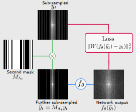

# Noisier2Noise for reconstruction
**A framework for self-supervised MR image reconstruction using sub-sampling**

Charles Millard, Mark Chiew

[arXiv](http://128.84.4.34/abs/2205.10278) | [BibTeX](#citation)



## Usage 


### Training
To train a network, run

```bash
python train_network.py config_name
```

where config_name is name of one of the configuration files in the configs folder. For instance,  
```bash
python train_network.py 1D_partitioned_ssdu
```
trains according to the configuration in the 1D_partitioned_SSDU.yaml file. 
We have provided an example configuration file for each of the training methods in the paper. All of the example configurations
are for 8x column-wise sub-sampled data.

The configuration file, progress on the training and validation set, and model parameters are saved in the log directory.

### Testing

To test a network, run 

```bash
python train_network.py log_location
```
where log_location is the location of the saved network. For instance,

```bash
python test_network.py logs/cpu/1D_partitioned_ssdu/20221214-120656
```


### Data
The code is designed to train on the fastMRI knee or brain dataset, which can be downloaded from
https://fastmri.org/. The path of the data should be
given in the configuration file. We have included the necessary fastMRI code in this package.

## Contact

If you have any questions/comments, please feel free to contact Charles
(Charlie) Millard at [charles.millard@ndcn.ox.ac.uk](charles.millard@ndcn.ox.ac.uk) or Mark Chiew at
[mark.chiew@utoronto.ca](mark.chiew@utoronto.ca)

## Citation
If you use this code, please cite our article:
```
@misc{millard2022framework,
    title={A framework for self-supervised MR image reconstruction using sub-sampling via Noisier2Noise},
    author={Charles Millard and Mark Chiew},
    year={2022},
    eprint={2205.10278},
    archivePrefix={arXiv},
    primaryClass={eess.IV}
}
```

## Copyright and Licensing

This program is free software: you can redistribute it and/or modify
it under the terms of the GNU General Public License as published by
the Free Software Foundation, either version 3 of the License, or
(at your option) any later version.

This program is distributed in the hope that it will be useful,
but WITHOUT ANY WARRANTY; without even the implied warranty of
MERCHANTABILITY or FITNESS FOR A PARTICULAR PURPOSE.  See the
GNU General Public License for more details.

A copy of the GNU General Public License can be found in the file GNU_General_Public_License,
and is also availabe [here](https://www.gnu.org/licenses/).